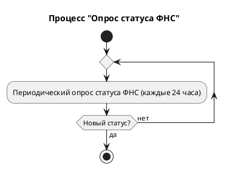
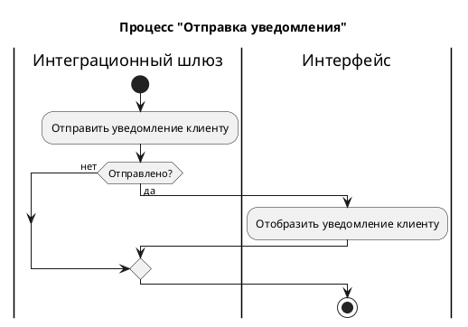

# Activity Diagram: социальный вычет за обучение

# Описание значимости артефакта

## Процесс и контекст использования

Артефакт используется в рамках бизнес-процесса «Оформление социального налогового вычета за обучение» в мобильном приложении / интернет-банке.

## Цель создания

Артефакт решает задачу формализации и визуализации сквозного процесса оформления вычета, включая все интеграционные взаимодействия с внешними системами (компании-партнёры, ФНС). Он служит единым источником правды для понимания последовательности шагов, условий ветвлений и точек принятия решений.

## Что становится определено

- Логика процесса - строгая последовательность действий клиента, интерфейса, сервисов и шлюзов.
- API-контракты - перечень эндпоинтов 
- Модель данных - задействованные таблицы и ключевые поля. 
- Интеграционные сценарии - взаимодействие с интеграционным шлюзом и периодический опрос статусов ФНС. 
- Условия ветвления - критерии перехода между статусами. 
- Пользовательские сценарии - точки взаимодействия с клиентом и отображаемые уведомления.

## Пользователи артефакта

- Системные аналитики - для уточнения требований и детализации логики. 
- Разработчики - для реализации API, сервисной логики и интеграционных модулей. 
- Тестировщики (QA) - для проектирования тест-кейсов и проверки полного цикла процесса. 
- Менеджеры продукта / владельцы требований - для оценки сроков, рисков и согласования с заинтересованными сторонами. 
- Архитекторы - для проверки согласованности интеграционных взаимодействий.

## Использование в дальнейшем

Артефакт пригодится для:

- Перехода к детальному проектированию
- Распараллеливания разработки
- Планирования инфраструктуры
- Обучения команды

## Последствия отсутствия

При отсутствии артефакта могут возникнуть следующие последствия:

- Потеря целостного видения
- Риски пропуска шагов или статусов
- Усложнение интеграции
- Затруднение тестирования
- Увеличение сроков разработки

# Описание шагов Activity Diagram

| **Актор** | **Действие (шаг)** | **Описание** |
| --- | --- | --- |
| **Этап 1. Выбор периода и категории** |  |  |
| Клиент | Перейти в раздел "Налоговый вычет" | Пользователь инициирует процесс, заходя в соответствующий раздел банковского приложения или личного кабинета. |
| Интерфейс | GET /api/v1/deductions | Система направляет запрос в сервис для получения данных о доступных налоговых периодах (годах). |
| Сервис | Запрос к таблице transaction | Бэкенд-сервис выполняет запрос к базе данных для получения агрегированных данных по транзакциям клиента. |
| Интерфейс | Отобразить доступные года | Пользовательский интерфейс визуализирует список годов, за которые можно получить вычет, с указанием предполагаемой суммы возврата. |
| Интерфейс | Ветвление: Данные отобразились? | Да: переход к следующему шагу. Нет: переход к этапу 6 (Вариант Б) |
| Клиент | Выбрать год, категорию и транзакцию | Пользователь последовательно выбирает налоговый период (год), категорию расходов "Обучение" и конкретный платёж из списка транзакций. |
| **Этап 2. Проверка партнерства** |  |  |
| Интерфейс | GET /api/v1/deductions/check-partner?inn={inn} | Система отправляет запрос на проверку ИНН получателя платежа. |
| Сервис | Проверить, является ли компания-получатель платежа партнером банка | Бэкенд проверяет, компания-получатель является партнером банка |
| Интерфейс | Ветвление: Компания является партнером? | Да: переход к этапу 3. Нет: переход к этапу 6 (Вариант А) |
| **Этап 3. Заполнение заявления и отправка партнеру** |  |  |
| Интерфейс | Отобразить кнопку "Оформить вычет" | Для партнерской организации становится доступна функция упрощенного оформления. |
| Клиент | Нажать кнопку "Оформить вычет" | Пользователь инициирует процесс создания заявления. |
| Интерфейс | Отобразить форму для заполнения | Система показывает пользователю форму для ввода дополнительных данных (получатель вычета, реквизиты счета и пр.). |
| Клиент | Заполнить форму | Пользователь заполняет необходимые поля формы для получения налогового вычета. |
| Интерфейс | POST /api/v1/deductions/requests | Запрос на создание заполненного заявления. |
| Сервис | Валидация данных | Проверка корректности заполнения формы. |
| Интерфейс | Отобразить ошибки валидации | При обнаружении ошибок интерфейс уведомляет пользователя с подсветкой некорректных полей. |
| Сервис | Ветвление: Данные валидны? | Да: следующий шагНет: возврат к шагу “Заполнить форму“ |
| Сервис | Сохранение в таблицу recipient | Сохранение данных о получателе вычета (реквизиты счета клиента). |
| Сервис | Сохранение в таблицу request | Создание записи о заявке со статусом ожидания “Ожидание отправки“. |
| Сервис | Ветвление: Данные сохранились? | Да: следующий шагНет: возврат к шагу “Сохранение в таблицу recipient“ |
| Интеграционный шлюз | Отправить заявление в компанию-партнер | Передача сформированного заявления в информационную систему образовательной организации. |
| Интеграционный шлюз | Ветвление: Отправка успешна? | Да: следующий шагНет: завершения процесса |
| Сервис | Обновить статус в таблице request | Обновление статуса заявления на статус “Заявление отправлено поставщику услуги“ |
| **Этап 4. Ожидание подтверждения от партнера** |  |  |
| Интеграционный шлюз | Цикл: Получить подтверждение отправки в ФНС от компании-партнера | Шлюз периодически (с заданным интервалом) опрашивает партнера для получения подтверждения о том, что заявление передано в ФНС. |
| Сервис | Ветвление: Ответ получен? | Да: следующий шаг. Нет: предыдущий шаг. |
| Сервис | Ветвление: Ответ успешный? | Да: следующий шаг. Нет: завершить процесс. |
| Сервис | Обновить статус в таблице request | Статус заявки обновляется на “Справка направлена в ФНС“. |
| Сервис | Сохранить id ФНС в таблицу request | Сохранение идентификатора заявления в ФНС для последующего отслеживания статуса. |
| **Этап 5. Цикл обработки статусов ФНС** |  |  |
| Интеграционный шлюз | Обработать процесс "Опрос статуса ФНС” | Шлюз инициирует периодический опрос статуса заявления в ФНС. Процесс включает цикл: отправка запроса, ожидание ответа, проверка изменения статуса. Опрос выполняется каждые 24 часа.Цикл продолжается до тех пор, пока заявление не будет исполнено или не наступит условие отказа. |
| Сервис | Обновить статус в таблице request | Выполняется обновление статуса в базе данных ("Сформировано предзаполненное заявление" - "Проверка" - "Возврат" - "Исполнено" - "Отказ"). |
| Интеграционный шлюз | Обработать процесс "Отправка уведомления" | Отправка уведомления клиенту (формирование, отправка, проверка доставки). |
| Интеграционный шлюз | Ветвление: Заявление исполнено/отказано? | Да: процесс завершается. Нет: возврат к этапу 5. |
| **Этап 6. Альтернативные завершения** |  |  |
| **Вариант А. Компания не партнер** |  |  |
| Интерфейс | Отобразить подсказку | Пользователю отображается сообщение: "Для получения вычета по данной операции вам необходимо обратиться в организацию, предоставившую услугу, и получить справки для самостоятельной подачи в ФНС". Процесс завершается. |
| **Вариант Б. Нет доступных операций** |  |  |
| Интерфейс | Отобразить подсказку | При отсутствии данных о транзакциях пользователю отображается сообщение: "Нет операций для получения налогового вычета". Процесс завершается. |

## Процесс оформления социального налогового вычета за обучение

```plantuml
@startuml диаграмма деятельности
title Процесс оформления социального налогового вычета за обучение

|Клиент|
start
:Перейти в раздел\n"Налоговый вычет";

|Интерфейс|
:GET /api/v1/deductions;

|Сервис|
:Запрос к таблице\ntransaction;

|Интерфейс|
:Отобразить доступные года;

if (Данные отобразились?) then (да)

    |Клиент|
    :Выбрать год, категорию\nи транзакцию;

    |Интерфейс|
    :GET /api/v1/deductions/
    check-partner?inn={inn};
        
    |Сервис|
    :Проверить, является ли\nкомпания-получатель платежа\nпартнером банка;
    
    if (Компания является партнером?) then (да) 
        |Интерфейс|
        :Отобразить кнопку\n"Оформить вычет";
            
        |Клиент|
        :Нажать кнопку\n"Оформить вычет";
            
        |Интерфейс|
        :Отобразить форму\nдля заполнения;

        |Клиент|
        repeat
            :Заполнить форму;
                
            |Интерфейс|
            :POST /api/v1/deductions/requests;

            |Сервис|
            :Валидация данных;
            |Интерфейс|
            backward:Отобразить ошибки валидации; 
            |Сервис|
        repeat while (Данные валидны?) is (нет) not (да)

        repeat   
            :Сохранение в таблицу recipient;
            :Сохранение в таблицу request;
        repeat while (Данные сохранились?) is (нет) not (да)
            
        |Интеграционный шлюз|
        :Отправить заявление\nв компанию-партнер;
        if (Отправка успешная?) then (да)
            
            |Сервис|
            :Обновить статус\nв таблице request;
            
            |Интеграционный шлюз|
            repeat  
                :Получить подтверждение отправки\nв ФНС от компании-партнера;

            repeat while (Ответ получен?) is (нет) not (да)
            if (Ответ успешный?) then (да)

                |Сервис|
                fork
                    :Обновить статус\nв таблице request;
                fork again  
                    :Сохранить id ФНС\nв таблицу request;  
                fork end

                |Интеграционный шлюз|
                repeat  
                    :Обработать процесс\n"Опрос статуса ФНС";

                    |Сервис|
                    :Обновить статус\nв таблице request;

                    |Интеграционный шлюз|
                    :Обработать процесс\n"Отправка уведомления";
                repeat while (Заявление исполнено/отказано?) is (нет) not (да) 
                stop          

            else (нет)
                |Интеграционный шлюз|
                end
            endif

        else (нет)
            |Интеграционный шлюз|
            end
        endif

    else (не является партнером)
        |Интерфейс|
        :Отобразить подсказку;
        end
    endif

else (нет)
    |Интерфейс|
    :Отобразить подсказку;
    end
endif

@enduml
```

## Процесс "Опрос статуса ФНС"


## Процесс "Отправка уведомления"

