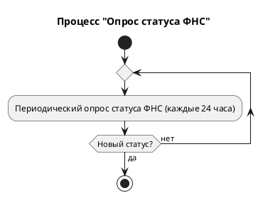
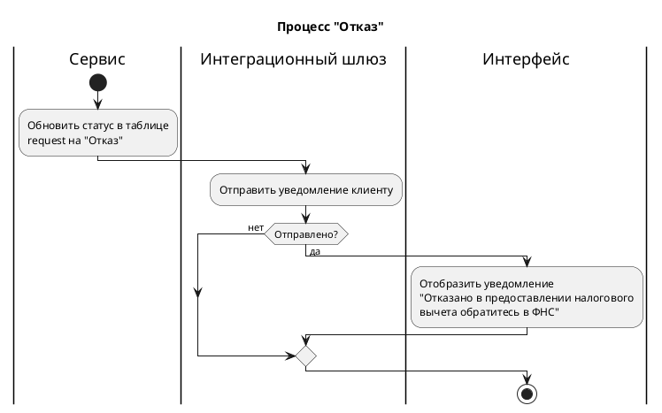
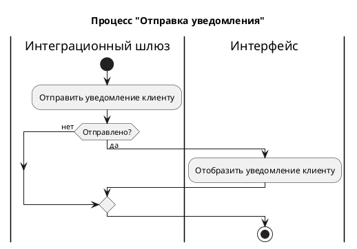

# Activity Diagram: социальный вычет за обучение

# Описание значимости артефакта

## Процесс и контекст использования

Артефакт используется в рамках бизнес-процесса «Оформление социального налогового вычета за обучение» в мобильном приложении / интернет-банке.

## Цель создания

Артефакт решает задачу формализации и визуализации сквозного процесса оформления вычета, включая все интеграционные взаимодействия с внешними системами (компании-партнёры, ФНС). Он служит единым источником правды для понимания последовательности шагов, условий ветвлений и точек принятия решений.

## Что становится определено

- Логика процесса - строгая последовательность действий клиента, интерфейса, сервисов и шлюзов.
- API-контракты - перечень эндпоинтов 
- Модель данных - задействованные таблицы и ключевые поля. 
- Интеграционные сценарии - взаимодействие с интеграционным шлюзом и периодический опрос статусов ФНС. 
- Условия ветвления - критерии перехода между статусами. 
- Пользовательские сценарии - точки взаимодействия с клиентом и отображаемые уведомления.

## Пользователи артефакта

- Системные аналитики - для уточнения требований и детализации логики. 
- Разработчики - для реализации API, сервисной логики и интеграционных модулей. 
- Тестировщики (QA) - для проектирования тест-кейсов и проверки полного цикла процесса. 
- Менеджеры продукта / владельцы требований - для оценки сроков, рисков и согласования с заинтересованными сторонами. 
- Архитекторы - для проверки согласованности интеграционных взаимодействий.

## Использование в дальнейшем

Артефакт пригодится для:

- Перехода к детальному проектированию
- Распараллеливания разработки
- Планирования инфраструктуры
- Обучения команды

## Последствия отсутствия

При отсутствии артефакта могут возникнуть следующие последствия:

- Потеря целостного видения
- Риски пропуска шагов или статусов
- Усложнение интеграции
- Затруднение тестирования
- Увеличение сроков разработки

# Описание шагов Activity Diagram

| **Актор** | **Действие (шаг)** | **Описание** |
| --- | --- | --- |
| **Этап 1. Выбор периода и категории** |  |  |
| Клиент | Перейти в раздел "Налоговый вычет" | Пользователь инициирует процесс, заходя в соответствующий раздел банковского приложения или личного кабинета. |
| Интерфейс | GET /api/v1/deductions | Система направляет запрос в сервис для получения данных о доступных налоговых периодах (годах). |
| Сервис | Запрос к таблице transaction | Бэкенд-сервис выполняет запрос к базе данных для получения агрегированных данных по транзакциям. |
| Интерфейс | Отобразить доступные года с суммами к получению | Пользовательский интерфейс визуализирует список годов, за которые можно получить вычет, с указанием предполагаемой суммы возврата. |
| Клиент | Выбрать год | Пользователь выбирает интересующий его налоговый период (год). |
| Интерфейс | Отобразить категории за выбранный год | Система показывает доступные категории расходов (обучение, лечение и т.д.). |
| Клиент | Выбрать категорию "Обучение" | Пользователь выбирает категорию трат, по которой хочет оформить вычет. |
| **Этап 2. Выбор транзакции** |  |  |
| Интерфейс |Отобразить транзакции по категории | Система показывает список платежей за обучение в выбранном году. |
| Клиент | Выбрать транзакцию для оформления вычета | Пользователь выбирает конкретный платеж, по которому будет оформляться возврат НДФЛ. |
| **Этап 3. Проверка партнерства** |  |  |
| Интерфейс | GET /api/v1/deductions/check-partner?inn={inn} | Система отправляет запрос на проверку ИНН получателя платежа. |
| Сервис | Проверить, является ли компания-получатель платежа партнером банка | Бэкенд проверяет, компания-получатель является партнером банка |
| Интерфейс | Ветвление: Компания является партнером? | Да - Этап 4. Нет - Отобразить подсказку о необходимости обращения в организацию напрямую (этап 9, вариант В). |
| **Этап 4. Заполнение заявления и отправка партнеру** |  |  |
| Интерфейс | Отобразить кнопку "Оформить вычет" | Для партнерской организации становится доступна функция упрощенного оформления. |
| Клиент | Нажать кнопку "Оформить вычет" | Пользователь инициирует процесс создания заявления. |
| Интерфейс | Отобразить форму для заполнения | Система показывает пользователю форму для ввода дополнительных данных (реквизиты счета и пр.). |
| Клиент | Заполнить форму для получения вычета | Пользователь заполняет необходимые поля формы. |
| Интерфейс | POST /api/v1/deductions/requests | Отправка заполненного заявления в сервис. |
| Сервис | Валидация данных | Проверка корректности заполнения формы. |
| Интерфейс | Отобразить ошибки валидации | При обнаружении ошибок интерфейс уведомляет пользователя |
| Сервис | Ветвление: Данные валидны? | Нет - возврат к заполнению формы. Да - следующий шаг |
| Сервис | Сохранение в таблицу recipient | Данные о получателе вычета сохраняются в базу |
| Сервис | Ветвление: Данные сохранились? | Нет - повторная попытка сохранения. Да - следующий шаг |
| Сервис | Сохранение в таблицу request со статусом «Ожидание отправки» | Создаётся запись о заявке с начальным статусом |
| Сервис | Ветвление: Данные сохранились? | Нет - повторная попытка сохранения. Да - следующий шаг |
| Интеграционный шлюз | Отправить заявление в компанию-партнер | Передача сформированного заявления в информационную систему образовательной организации. |
| Интеграционный шлюз | Ветвление: Отправка успешна? |Нет - повторная попытка отправки. Да - следующий шаг |
| Сервис | Обновить статус в таблице request на "Заявление отправлено поставщику услуги" | Обновление статуса заявки в базе данных банка. |
| **Этап 5. Ожидание ответа от партнера и ФНС** |  |  |
| Интеграционный шлюз | Цикл: Получить подтверждение отправки в ФНС от компании-партнера | Шлюз периодически опрашивает партнера. |
| Интеграционный шлюз | Ветвление: Ответ получен? | Нет - продолжение ожидания. Да - следующий шаг. |
| Сервис | Ветвление: Ответ успешный? | Да - следующий шаг. Нет - начать заново этап 5. |
| Сервис | Обновление статуса на "Справка направлена в ФНС” | Статус заявки обновляется. |
| Сервис | Сохранение идентификатора ФНС в таблицу request | Сохранение идентификатора заявления в ФНС для последующего отслеживания. |
| **Этап 6. Проверка готовности заявления в ФНС** |  |  |
| Интеграционный шлюз | Цикл: Периодический опрос статуса ФНС (каждые 24 часа) | Шлюз проверяет статус обработки заявления в ФНС |
| Сервис | Ветвление: Статус подготовки = "Сформировано"? | Да - следующий шаг. Нет - начать заново этап 6. |
| Сервис | Обновить статус в таблице request на "Сформировано предзаполненное заявление" | Статус заявки обновлен. |
| Интеграционный шлюз | Отправить уведомление клиенту | Отправляется push-уведомление клиенту. |
| Интеграционный шлюз | Ветвление: Отправлено? | Нет - повторная попытка отправки. Да - следующий шаг. |
| Интерфейс | Отобразить уведомление о необходимости подписания в ЛК ФНС | Пользователю предлагается перейти в личный кабинет на сайте ФНС для подписания. |
| Клиент | Перейти в ЛК ФНС и подписать заявление | Пользователь выходит из системы банка и подписывает заявление в ЛК ФНС. |
| **Этап 7. Ожидание результатов камеральной проверки** |  |  |
| Интеграционный шлюз | Цикл: Периодический опрос статуса ФНС (каждые 24 часа) | Проверка статуса подачи заявления. |
| Сервис | Ветвление: Статус подачи = "Утверждено"? | Да - следующий шаг. Нет - начать заново этап 7. |
| Сервис | Обновить статус в таблице request на "Проверка" | Статус заявки обновлен (начало камеральной проверки). |
| Интеграционный шлюз | Отправить уведомление клиенту | Уведомление о начале проверки. |
| Интерфейс | Отобразить уведомление о начале камеральной проверки | Пользователь видит, что его заявление на проверке. |
| Интеграционный шлюз | Цикл: Периодический опрос статуса ФНС (каждые 24 часа) | Ожидание окончания проверки. |
| Сервис | Ветвление: Статус проверки = "Подтверждено"? | Да - следующий шаг. Нет - этап 9, вариант Б. |
| **Этап 8. Ожидание денежного перевода (Возврат)** |  |  |
| Сервис | Обновить статус в таблице request на "Возврат" | Статус заявки обновлен. |
| Интеграционный шлюз | Отправить уведомление клиенту | Уведомление об успешной проверке. |
| Интерфейс | Отобразить уведомление об успешном прохождении проверки | Пользователь информирован, что скоро поступят деньги. |
| Интеграционный шлюз | Цикл: Периодический опрос статуса ФНС (каждые 24 часа) | Ожидание статуса денежного перевода. |
| Сервис | Ветвление: Статус возврата = "Исполнено"? | Да - к следующему шагу. Нет - этап 9, вариант Б. |
| **Этап 9. Завершающие статусы** (Успех / Отказ) |  |  |
| **Вариант А. Успех** |  |  |
| Сервис | Обновить статус в таблице request на "Исполнено” | Заявка успешно закрыта. |
| Интеграционный шлюз | Отправить уведомление клиенту | Уведомление о зачислении средств. |
| Интерфейс | Отобразить уведомление об исполнении заявления |  |
| **Вариант Б. Отказ** (на разных этапах) |  |  |
| Сервис | Обновить статус в таблице request на "Отказ" | Заявка отклонена (причина: ошибка в данных, отказ ФНС, истек срок и т.д.). |
| Интеграционный шлюз | Отправить уведомление клиенту | Отправка уведомления об отказе. |
| Интерфейс | Отобразить уведомление "Отказано... обратитесь в ФНС" | Пользователь информирован о необходимости обратиться в ФНС для выяснения причин. Переход к шагу "Стоп". |
| **Вариант В. Компания не партнер** |  |  |
| Интерфейс | Отобразить подсказку | Пользователю предлагается обратиться в организацию за справками самостоятельно. Процесс завершается. |

## Процесс оформления социального налогового вычета за обучение

```plantuml
@startuml диаграмма деятельности
title Процесс оформления социального налогового вычета за обучение

|Клиент|
start
:Перейти в раздел\n"Налоговый вычет";

|Интерфейс|
:GET /api/v1/deductions;

|Сервис|
:Запрос к таблице\ntransaction;

|Интерфейс|
:Отобразить доступные года\nс суммами к получению;

if (Данные отобразились?) then (да)

    |Клиент|
    :Выбрать год;

    |Интерфейс|
    :Отобразить категории\nза выбранный год;

    if (Отобразилась категория "Обучение"?) then (да)

        |Клиент|
        :Выбрать категорию\n"Обучение";

        |Интерфейс|
        :Отобразить транзакции\nпо категории;

        |Клиент|
        :Выбрать транзакцию\nдля оформления вычета;

        |Интерфейс|
        :GET /api/v1/deductions/
        check-partner?inn={inn};
        
        |Сервис|
        :Проверить, является ли\nкомпания-получатель платежа\nпартнером банка;
    
        if (Компания является партнером?) then (да) 
            |Интерфейс|
            :Отобразить кнопку\n"Оформить вычет";
            
            |Клиент|
            :Нажать кнопку\n"Оформить вычет";
            
            |Интерфейс|
            :Отобразить форму\nдля заполнения;

            |Клиент|
            repeat
                :Заполнить форму\nдля получения вычета;
                
                |Интерфейс|
                :POST /api/v1/deductions/requests;

                |Сервис|
                :Валидация данных;
                |Интерфейс|
                backward:Отобразить ошибки валидации;  
                |Сервис|
            repeat while (Данные валидны?) is (нет) not (да)

            repeat   
                :Сохранение в таблицу recipient;
            repeat while (Данные сохранились?) is (нет) not (да)

            repeat
                :Сохранение в таблицу request\nсо статусом "Ожидание отправки";
            repeat while (Данные сохранились?) is (нет) not (да)
            
            |Интеграционный шлюз|
            repeat
                :Отправить заявление\nв компанию-партнер;
            repeat while (Отправка успешная?) is (нет) not (да)
            
            |Сервис|
            :Обновить статус в таблице request на\n"Заявление отправлено поставщику услуги";
        
            |Интеграционный шлюз|
            repeat  
                :Получить подтверждение отправки\nв ФНС от компании-партнера;

            repeat while (Ответ получен?) is (нет) not (да)
            if (Ответ успешный?) then (да)

            |Сервис|
            fork
                :Обновление статуса на\n"Справка направлена в ФНС";
            fork again  
                :Сохранение id ФНС\nв таблицу request;  
            fork end

            |Интеграционный шлюз|
            :Обработать процесс\n"Опрос статуса ФНС";

            |Сервис|
            if (Статус подготовки = "Сформировано"?) then (да)

                    :Обновить статус в таблице request на\n"Сформировано предзаполненное заявление";
                    
                    |Интеграционный шлюз|
                    repeat
                        :Отправить уведомление\nклиенту;
                    repeat while (Отправлено?) is (нет) not (да)

                    |Интерфейс|
                    :Отобразить уведомление\nо необходимости\nподписания в ЛК ФНС;
                    
                    |Клиент|
                    :Перейти в ЛК ФНС\nи подписать заявление;

                    |Интеграционный шлюз|
                    :Обработать процесс\n"Опрос статуса ФНС";

                    |Сервис|
                    if (Статус подачи = "Утверждено") then (да)
                        :Обновить статус в таблице\nrequest на "Проверка";

                        |Интеграционный шлюз|
                        :Обработать процесс\n"Отправка уведомления";

                        |Интеграционный шлюз|
                        :Обработать процесс\n"Опрос статуса ФНС";
                        
                        |Сервис|
                        if (Статус проверки = "Подтверждено") then (да)
                                
                            :Обновить статус в таблице\nrequest на "Возврат";

                            |Интеграционный шлюз|
                            :Обработать процесс\n"Отправка уведомления";

                            |Интеграционный шлюз|
                            :Обработать процесс\n"Опрос статуса ФНС";

                            |Сервис|
                            if (Статус возврата = "Исполнено") then (да)
                                :Обновить статус в таблице\nrequest на "Исполнено";

                                |Интеграционный шлюз|
                                :Обработать процесс\n"Отправка уведомления";
                                    
                            else (нет)  
                                |Сервис|
                                :Обработать процесс\n"Отказ";
                                    
                            endif

                        else (нет)
                            |Сервис|
                            :Обработать процесс\n"Отказ";
                        endif

                    else (нет)     
                        |Сервис|
                        :Обработать процесс\n"Отказ";
                    endif

                else (нет)
                
                    |Сервис|
                    :Обработать процесс\n"Отказ";
                endif

            else (нет)
            endif

        else (не является партнером)
            |Интерфейс|
            :Отобразить подсказку:\n"Для получения вычета по данной операции\nвам необходимо обратиться в организацию,\nпредоставившую услугу";
        endif

    else (нет)
        |Интерфейс|
    endif

else (нет)
    |Интерфейс|
    :Отобразить подсказку:\n"Нет операций для получения\nналогового вычета";
endif

|Клиент|
stop
@enduml
```
## Процесс "Опрос статуса ФНС"



## Процесс "Отказ"


## Процесс "Отправка уведомления"

