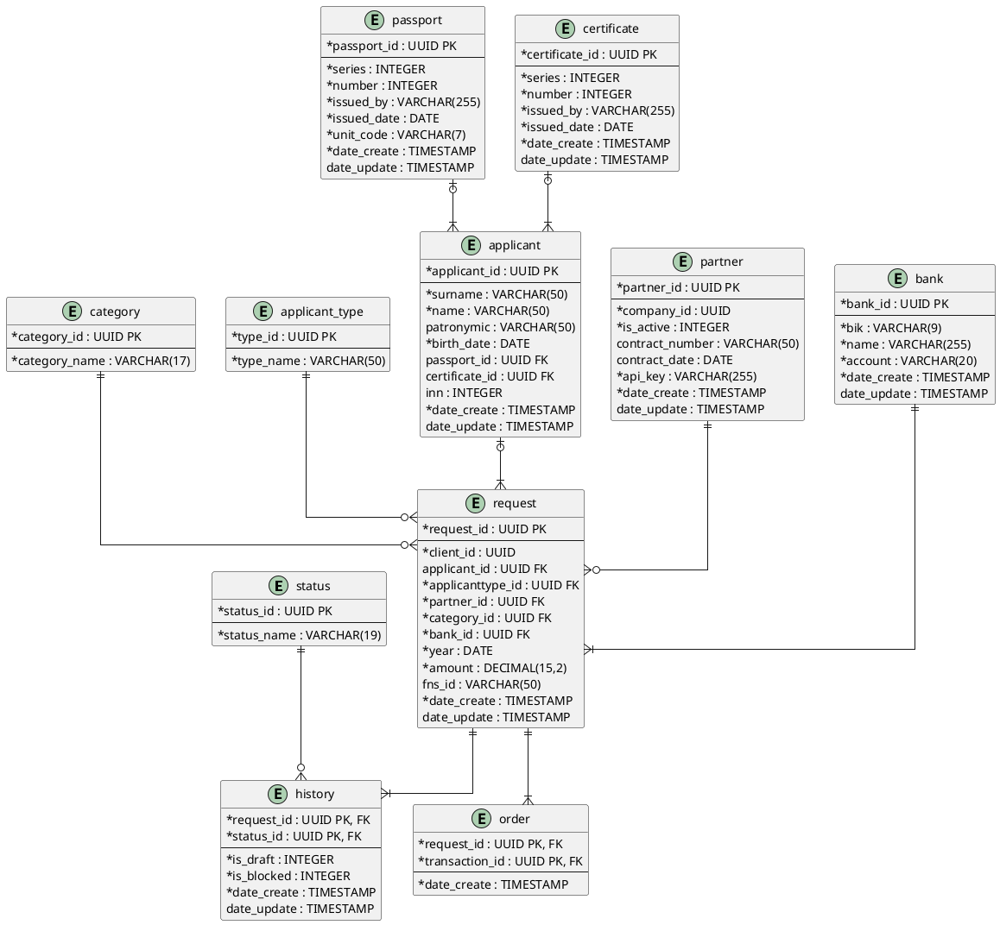
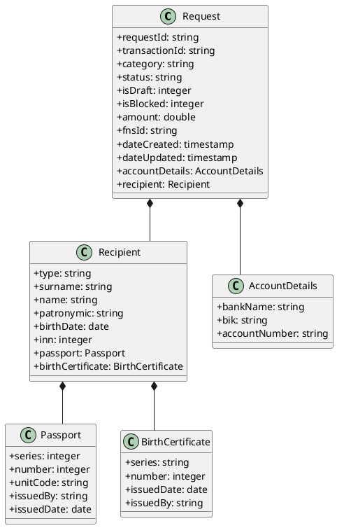

# Описание баз данных
## Концептуальная модель 


## Физическая модель




### status

| **Атрибут** | **Тип данных** | **Ограничение** | **Описание** |
| --- | --- | --- | --- |
| status_id | UUID | PK | Уникальный идентификатор |
| status_name | VARCHAR(19) | NOT NULL, UNIQUE | Название статуса. Доступные статусы:Создано, Отправлено партнеру, Отправлено в ФНС, Заполнено, Подтверждено, Возврат, Исполнено, Отказ |

### category

| **Атрибут** | **Тип данных** | **Ограничение** | **Описание** |
| --- | --- | --- | --- |
| category_id | UUID | PK | Уникальный идентификатор |
| category_name | VARCHAR(17) | NOT NULL, UNIQUE | Название категории. Доступные категории: Медицина, Обучение, Спорт, Благотворительность, Страхование, Пенсионные взносы |

### applicanttype

| **Атрибут** | **Тип данных** | **Ограничение** | **Описание** |
| --- | --- | --- | --- |
| type_id | UUID | PK | Уникальный идентификатор |
| type_name | VARCHAR(50) | NOT NULL, UNIQUE | Тип получателя. Доступные типы получателей:За себя, Супруг, Родитель, Ребенок |

### passport

| **Атрибут** | **Тип данных** | **Ограничение** | **Описание** |
| --- | --- | --- | --- |
| passport_id | UUID | PK | Уникальный идентификатор |
| series | INTEGER | NOT NULL | Серия паспорта |
| number | INTEGER | NOT NULL | Номер паспорта |
| issued_by | VARCHAR(255) | NOT NULL | Кем выдан |
| issued_date | DATE | NOT NULL | Дата выдачи |
| unit_code | VARCHAR(7) | NOT NULL | Код подразделения (например, 123-456) |
| date_create | TIMESTAMP | NOT NULL, DEFAULT NOW() | Дата создания |
| date_update | TIMESTAMP | CHECK (date_update >= date_create) | Дата последнего изменения |

### certificate

| **Атрибут** | **Тип данных** | **Ограничение** | **Описание** |
| --- | --- | --- | --- |
| certificate_id | UUID | PK | Уникальный идентификатор свидетельства о рождении |
| series | VARCHAR(4) | NOT NULL | Серия свидетельства |
| number | INTEGER | NOT NULL | Номер свидетельства |
| issued_by | VARCHAR(255) | NOT NULL | Кем выдано |
| issued_date | DATE | NOT NULL | Дата выдачи |
| date_create | TIMESTAMP | NOT NULL, DEFAULT NOW() | Дата создания |
| date_update | TIMESTAMP | CHECK (date_update >= date_create) | Дата последнего изменения |

### applicant

| **Атрибут** | **Тип данных** | **Ограничение** | **Описание** |
| --- | --- | --- | --- |
| applicant_id | UUID | PK | Уникальный идентификатор |
| surname | VARCHAR(50) | NOT NULL | Фамилия |
| name | VARCHAR(50) | NOT NULL | Имя |
| patronymic | VARCHAR(50) |  | Отчество |
| birth_date | DATE | NOT NULL | Дата рождения |
| passport_id | UUID | FK | Паспорт |
| certificate_id | UUID | FK | Свидетельство о рождении |
| inn | INTEGER |  | ИНН |
| date_create | TIMESTAMP | NOT NULL, DEFAULT NOW() | Дата создания |
| date_update | TIMESTAMP | CHECK (date_update >= date_create) | Дата последнего изменения |

### partner

| **Атрибут** | **Тип данных** | **Ограничение** | **Описание** |
| --- | --- | --- | --- |
| partner_id | UUID | PK | Уникальный идентификатор |
| company_id | UUID | NOT NULL, UNIQUE | Внешний идентификатор компании |
| is_active | INTEGER | NOT NULL, DEFAULT 1 | Признак активности партнерства, где:0 - заблокирован1 - активный |
| contract | VARCHAR(50) |  | Номер договора |
| date_conclusion | DATE |  | Дата заключения договора |
| api_key | VARCHAR(255) | NOT NULL | Ключ для интеграции |
| date_create | TIMESTAMP | NOT NULL, DEFAULT NOW() | Дата создания |
| date_update | TIMESTAMP | CHECK (date_update >= date_create) | Дата последнего изменения |

### request

| **Атрибут** | **Тип данных** | **Ограничение** | **Описание** |
| --- | --- | --- | --- |
| request_id | UUID | PK | Уникальный идентификатор заявления |
| applicanttype_id | UUID | FK, NOT NULL | Тип получателя |
| client_id | UUID | NOT NULL | Внешний идентификатор клиента |
| applicant_id | UUID | FK | Получатель вычета |
| partner_id | UUID | FK, NOT NULL | Компания-партнер |
| category_id | UUID | FK, NOT NULL | Категория расходов |
| bank_id | UUID | FK, NOT NULL | Банковский счет для получения вычета |
| year | DATE | NOT NULL | Налоговый период (год) |
| amount | DECIMAL(15,2) | NOT NULL | Сумма возврата по заявлению |
| fns_id | VARCHAR(50) |  | Идентификатор заявления в ФНС |
| date_create | TIMESTAMP | NOT NULL, DEFAULT NOW() | Дата создания |
| date_update | TIMESTAMP | CHECK (date_update >= date_create) | Дата последнего изменения |

### history

| **Атрибут** | **Тип данных** | **Ограничение** | **Описание** |
| --- | --- | --- | --- |
| request_id | UUID | PK | Заявление на вычет |
| status_id | UUID | PK | Статус заявления |
| is_draft | INTEGER | NOT NULL, DEFAULT 0 | Утверждение заявления, где: 0 - не утверждено 1 - утверждено |
| is_blocked | INTEGER | NOT NULL, DEFAULT 1 | Активность заявления, где: 0 - заблокированный 1 - активный |
| date_create | TIMESTAMP | NOT NULL, DEFAULT NOW() | Дата установки статуса |
| date_update | TIMESTAMP | CHECK (date_update >= date_create) | Дата последнего изменения |

### order

| **Атрибут** | **Тип данных** | **Ограничение** | **Описание** |
| --- | --- | --- | --- |
| order_id | UUID | PK | Уникальный идентификатор |
| request_id | UUID | FK, NOT NULL | Заявление на вычет |
| transaction_id | UUID | FK, NOT NULL | Транзакция |
| date_create | TIMESTAMP | NOT NULL, DEFAULT NOW() | Дата создания |

### bank

| **Атрибут** | **Тип данных** | **Ограничение** | **Описание** |
| --- | --- | --- | --- |
| bank_id | UUID | PK | Уникальный идентификатор банковского счета |
| bik | INTEGER | NOT NULL | БИК банка |
| name | VARCHAR(255) | NOT NULL | Наименование банка |
| account | VARCHAR(20) | NOT NULL | Расчётный счет |
| date_create | TIMESTAMP | NOT NULL, DEFAULT NOW() | Дата создания |
| date_update | TIMESTAMP | CHECK (date_update >= date_create) | Дата последнего изменения |

## Диаграмма классов




### json schema

```json
{
  "$schema": "http://json-schema.org/draft-04/schema#",
  "type": "object",
  "additionalProperties": false,
  "required": [
    "requestId",
    "transactionId",
    "category",
    "status",
    "isDraft",
    "isBlocked",
    "dateCreated"
  ],
  "properties": {
    "requestId": {
      "type": "string",
      "format": "uuid"
    },
    "transactionId": {
      "type": "string",
      "format": "uuid"
    },
    "category": {
      "type": "string",
      "enum": ["education", "medical", "sport", "insurance", "pension", "charity"]
    },
    "status": {
      "type": "string",
      "enum": ["created", "sent_to_partner", "sent_to_fns", "prefilled", "verification", "refund", "completed", "rejected"]
    },
    "isDraft": {
      "type": "integer",
      "enum": [0, 1],
      "default": 0
    },
    "isBlocked": {
      "type": "integer",
      "enum": [0, 1],
      "default": 1
    },
    "recipient": {
      "type": "object",
      "additionalProperties": false,
      "required": ["type", "surname", "name", "birthDate"],
      "properties": {
        "type": {
          "type": "string",
          "enum": ["self", "spouse", "parent", "child"]
        },
        "surname": {
          "type": "string",
          "minLength": 1,
          "maxLength": 50
        },
        "name": {
          "type": "string",
          "minLength": 1,
          "maxLength": 50
        },
        "patronymic": {
          "type": "string",
          "minLength": 1,
          "maxLength": 50
        },
        "birthDate": {
          "type": "string",
          "format": "date"
        },
        "inn": {
          "type": "integer",
          "minimum": 1000000000,
          "maximum": 999999999999
        },
        "passport": {
          "type": "object",
          "additionalProperties": false,
          "required": ["series", "number", "unitCode", "issuedBy", "issuedDate"],
          "properties": {
            "series": {
              "type": "integer",
              "minimum": 1000,
              "maximum": 9999
            },
            "number": {
              "type": "integer",
              "minimum": 100000,
              "maximum": 999999
            },
            "unitCode": {
              "type": "string",
              "minLength": 7,
              "maxLength": 7
            },
            "issuedBy": {
              "type": "string",
              "minLength": 1,
              "maxLength": 255
            },
            "issuedDate": {
              "type": "string",
              "format": "date"
            }
          }
        },
        "birthCertificate": {
          "type": "object",
          "additionalProperties": false,
          "required": ["series", "number", "issuedDate", "issuedBy"],
          "properties": {
            "series": {
              "type": "string",
              "minLength": 1,
              "maxLength": 4
            },
            "number": {
              "type": "integer",
              "minimum": 100000,
              "maximum": 999999
            },
            "issuedDate": {
              "type": "string",
              "format": "date"
            },
            "issuedBy": {
              "type": "string",
              "minLength": 1,
              "maxLength": 255
            }
          }
        }
      },
      "anyOf": [
        { "required": ["passport"] },
        { "required": ["birthCertificate"] }
      ]
    },
    "accountDetails": {
      "type": "object",
      "additionalProperties": false,
      "required": ["bankName", "bik", "accountNumber"],
      "properties": {
        "bankName": {
          "type": "string",
          "minLength": 1,
          "maxLength": 255
        },
        "bik": {
          "type": "string",
          "minLength": 9,
          "maxLength": 9
        },
        "accountNumber": {
          "type": "string",
          "minLength": 20,
          "maxLength": 20
        }
      }
    },
    "amount": {
      "type": "number",
      "format": "double",
      "minimum": 0
    },
    "fnsId": {
      "type": "string"
    },
    "dateCreated": {
      "type": "string",
      "format": "date-time"
    },
    "dateUpdated": {
      "type": "string",
      "format": "date-time"
    }
  }
}
```
### json объект
```json
{
  "requestId": "550e8400-e29b-41d4-a716-446655440001",
  "transactionId": "550e8400-e29b-41d4-a716-446655440000",
  "category": "education",
  "status": "sent_to_fns",
  "isDraft": 1,
  "isBlocked": 1,
  "recipient": {
    "type": "spouse",
    "surname": "Иванов",
    "name": "Петр",
    "patronymic": "Иванович",
    "birthDate": "1990-01-01",
    "inn": 1234567890,
    "passport": {
      "series": 4512,
      "number": 345678,
      "unitCode": "123-456",
      "issuedBy": "Отделом УФМС России г. Москва",
      "issuedDate": "2023-05-15"
    }
  },
  "accountDetails": {
    "bankName": "Банк России",
    "bik": "044525225",
    "accountNumber": "40802810123456789012"
  },
  "amount": 15000.00,
  "dateCreated": "2025-01-15T10:00:00Z",
  "dateUpdated": "2025-01-20T15:30:00Z"
}
```

## Описание значимости артефакта

### Процесс и контекст использования

Артефакт используется в рамках процесса проектирования сервиса предоставления социального налогового вычета на этапе детального проектирования модели данных.

### Цель создания

Зафиксировать согласованную модель данныхдля сервиса предоставления социального налогового вычета, которая определяет, как данные будут храниться.

### Что становится определено

ER-диаграмма в нотации Чена - определены основные сущности бизнес-области, их атрибуты и связи

ER-диаграмма в нотации Мартина - определены таблицы, поля, типы данных, первичные и внешние ключи, связи

UML Class Diagram - определены коллекции, документы, вложенные структуры и типы данных 

JSON-Schema (Draft 4) — описаны схемы для валидации API-объекта, типы данных, обязательные поля и форматы

### Пользователи артефакта

Backend-разработчики - для реализации кода по моделям данных

Разработчики интеграций - для настройки обмена данными с внешними системами

Тестировщики - для проектирования тест-кейсов, генерации тестовых данных и проверки целостности на основе моделей данных  

Администраторы БД - для оптимизации запросов, создания индексов, планирования партиционирования на основе логической модели  

Архитекторы - для проверки согласованности моделей хранения с общей архитектурой

Аналитики - для понимания структуры данных

### Использование в дальнейшем

В дальнейшем артефакт используют за:

- Основу для создания миграций и генерации кода
- Основу для написания интеграционных и модульных тестов
- Основу для согласования с командами
- Валидацию данных
- Документацию

### Последствия отсутствия

При отсутствии артефакта могут возникнуть следующие последствия:

- Разработчики не имеют единого понимания модели данных
- Сложность интеграции с внешними системами
- Трудности масштабирования
- Усложняется тестирование и валидация
